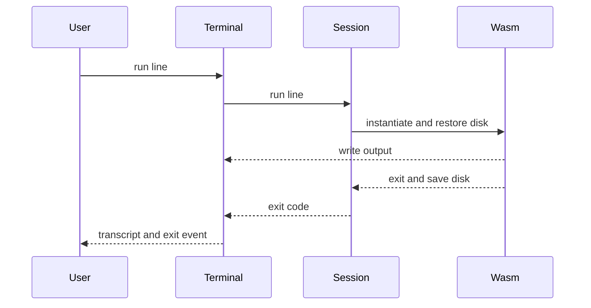

## Architecture Analysis

### System Overview

ドキュメント根拠: 開発者スキャン。静的配布とブラウザ内 CLI 実行を分離し、ツールごとのコンパイル成果物を共通端末で読み込む。

### Architectural Style

観測コードからの推測: モジュール分割されたブラウザライブラリとツール別ビルドアダプター。実行時にアプリケーションサーバーは置かない。責務の所有者は [component-inventory.md](component-inventory.md)。

### Component Relationships

ページ・iframe → カスタム要素 → Catalog と Session → Emscripten ビルド。ビルド配布 → Catalog のメタデータ。Node runner → 同じ Session。

### Data Flow

Session がセッションディスクを所有する。コマンドごとに新しい Emscripten インスタンスへ復元し、終了時に書き戻す。ファイル・ディレクトリ・シンボリックリンク・同一 inode のハードリンクを表現し、`/dev`、`/proc`、`/tmp` は保存から除外する。これは `src/session.ts` の読取根拠であり、実行検証の範囲は [code-quality-assessment.md](code-quality-assessment.md) に限定する。

### Interaction Diagrams

検証済み: Mermaid 12.1.0 の parser を一時ディレクトリで使用。直接 Bun `run aidlc/spaces/default/intents/261004-pitchfork-continuation/.aidlc-engine/mermaid-check/check.mjs` は exit 0、`{"valid":true,"diagramType":"sequence"}`。親エージェントが下の同一図を検証した。下の文章が図の代替説明を兼ねる。

文章による代替: 利用者の入力を要素が Session に渡す。Session がディスクを復元して CLI を起動し、出力を要素へ送る。終了時にディスクを保存して終了コードを返し、要素が終了イベントを発行する。

### Key Design Decisions

既決事項の記録（新規設計判断なし）: Emscripten、コマンドごとの新規インスタンス、単一の端末実装を維持する。ツール差分は `patches/tools/` とビルドスクリプトに置く。根拠は project.md と開発者スキャン。未採用のエミュレーター／カーネル方式は既存 design.md の比較に従う。

### Improvement Opportunities

今回の変更境界はツール別パッチ・配布カタログ・ページ選択・CI ビルド。共通 Session は再利用し、pitchfork ブラウザ実行と aube 回帰を検証する。検証不足は [code-quality-assessment.md](code-quality-assessment.md)。
