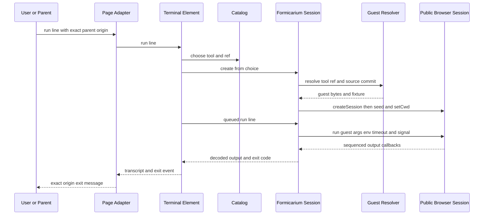
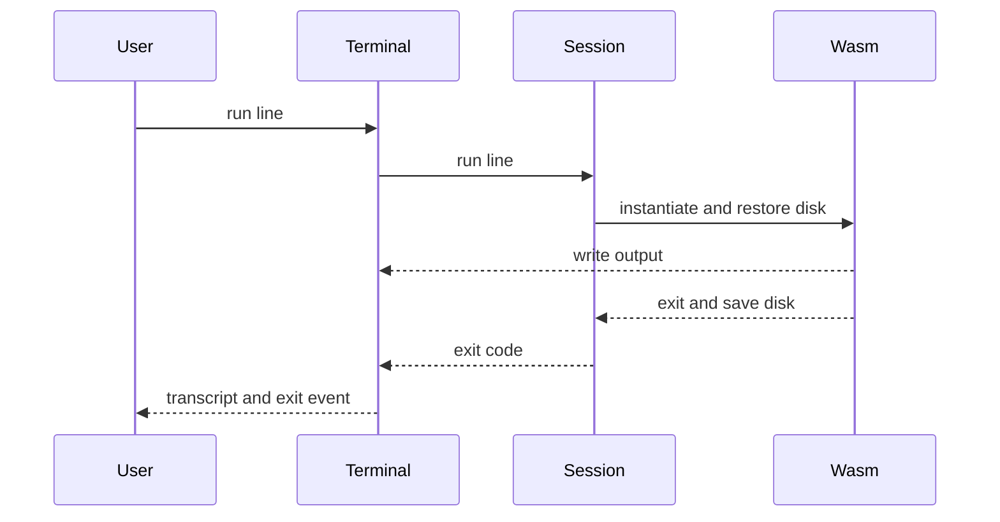

## Architecture Analysis

### System Overview
静的配布のCatalogとブラウザ端末に、外部Worker runtimeへの内部adapterを接続する。サーバー実行は追加されていない。

### Architectural Style
モジュール化されたブラウザライブラリ。実装の観測であり新規architecture決定ではない。component-inventoryに所有境界を示す。

### Component Relationships
Terrarium terminal element → Build catalog → Formicarium command adapter → public Browser Session。guest宣言なしはLegacy Session compatibility boundaryへ分岐。Formicarium asset stagingとSite assemblyが配布入力を整える。

### Data Flow
Choiceのtool/ref/commitとresolver identityを照合し、fixtureを/workへseedしてnested cwdへ移る。guest bytesをcopyし、直列queue経由でpublic runへ渡す。stdout/stderr別decoderと増加sequenceでcallbackのみ表示する。generation guardとdisposeが古い起動・実行結果を抑止する。

### Interaction Diagrams
以下は既存storeでMermaid parser検証済みの図を同一bytesで保持する。今回の新規parser実行はない。文章代替も併記する。

文章代替: parentはexact source/origin確認後に要素へrunを渡す。要素が選択済みbuildからadapterを準備し、resolverのguest/fixtureとpublic Sessionを接続する。queueで実行しcallbackから出力とexitを戻す。直接要素利用はPage Adapterを経由しない。

### Key Design Decisions
public Session/C3 resolver境界、same-origin Worker、identity/digest/provenance検証を現行接続条件として観測した。AGENTS/project memoryのEmscripten/no emulatorとBlink/static-musl guestの差は人のarchitecture判断として残す。

### Improvement Opportunities
現在sourceと新しい検証証跡を再結合し正式レビューする。途中write失敗のatomic replacement保証、公開RC、実Pages/service-worker、実Safariは未検証。詳しくは品質を参照。

根拠: [開発者引継ぎ](../../intents/261008-formicarium-integration-2/inception/reverse-engineering/developer-scan.md)。深い解析の個別23pathは[解析時点](reverse-engineering-timestamp.md)、証跡の適用性は[品質](code-quality-assessment.md)。

## Preserved Prior Store (historical; not current verification)

以下は前storeの文章を保存した履歴。今回範囲外の深い解析はshallowへ降格した。「現行」「確認済み」等は元intent時点の表現で、今回のfresh合格・承認を意味しない。上の今回評価を優先する。

## Architecture Analysis

### System Overview

静的配布とブラウザ内 CLI を分離する。既存 UI の下に public formicarium Session API への adapter が接続された現行実装を観測した。兄弟ランタイム内部は深い解析対象外。

### Architectural Style

観測上はモジュール構成のブラウザライブラリと外部 Worker runtime への adapter。配布時 staging が manifest/resolver/guest を接続する。サーバーで CLI を実行する構成は追加されていない。

### Component Relationships

Page Adapter → Terminal Element → Catalog / Formicarium Session → Guest Resolver / public Browser Session。Asset Staging が resolver と package assets、guest/provenance/fixtures を配置する。所有責務は [一覧](component-inventory.md)。

### Data Flow

catalog が tool/ref を選び、adapter が HTTP(S) base と resolver 結果の tool/ref/source.commit を照合する。fixture を `/work` に seed し public setCwd で cwd を選ぶ。guest bytes・args/env/timeout/AbortSignal を public run に渡し、単調 sequence と stdout/stderr 別 UTF-8 decoder で callback 出力を表示する。raw result の二重表示を避ける。要素の世代管理が古い非同期結果を抑止し session を破棄する。

### Interaction Diagrams

この図は起動後の最初の run を概念的に表す（選択/生成は準備処理）。Mermaid 12.1.0 parser、mise exec -- bun、exit 0、diagramType sequence。[検証記録](../../intents/261008-formicarium-integration/inception/reverse-engineering/evidence/mermaid-validation.json)。

文章による代替: 親メッセージは exact source/origin で照合して要素に届く。要素の選択から adapter が resolver に guest/fixture を要求し、public Session を初期化する。コマンドを queue で渡し、callback 出力を decode して表示し、exit を要素イベントと親通知に戻す。要素直接利用では Page Adapter を経由しない。

### Key Design Decisions

既存実装の観測であり新規決定ではない。public API 境界・origin 照合・digest/provenance 検証・同一 origin Worker 配置が接続条件。project memory は Emscripten/no emulator を既決として保持するが、現行 local integration は blink assets と static-musl guest を利用する。この方針差を承認済み戦略として上書きしない。人の方針確認事項として残す。

### Improvement Opportunities

直前のローカル受入れ証拠は現行ソース/候補に適用できる。CIのimmutable入力供給、絶対tarball/兄弟依存、producer増分追加のretained assets、stagingのatomic replacement/cleanup観測はConstructionで修正可能。実Pages/service-worker、公開RC、実Safariは別の配布受入れ条件。[品質](code-quality-assessment.md)に解決済みと残作業を区別した。

根拠: [開発者スキャン](../../intents/261008-formicarium-integration/inception/reverse-engineering/developer-scan.md)。現在の深い解析範囲は [解析時点](reverse-engineering-timestamp.md)、検証証拠と制約は [品質](code-quality-assessment.md)。

再調査根拠: exact25 snapshot 後の全25ファイル再読・raw SHA25/25一致、直前のimported source/candidate再比較64/64一致。[再調査記録](../../intents/261008-formicarium-integration/inception/reverse-engineering/evidence/exact-scope-rescan-verification.json)。今回新規テスト実行なし。

## Prior Knowledge (historical, shallow outside current focus)

以下は `261004-pitchfork-continuation` の記述を保持したもの。旧 deep coverage は UNVERIFIED のため今回の verified deep 範囲に継承しない。現行 focus については上の記述を優先する。

## Historical: Architecture Analysis

### Historical: System Overview

ドキュメント根拠: 開発者スキャン。静的配布とブラウザ内 CLI 実行を分離し、ツールごとのコンパイル成果物を共通端末で読み込む。

### Historical: Architectural Style

観測コードからの推測: モジュール分割されたブラウザライブラリとツール別ビルドアダプター。実行時にアプリケーションサーバーは置かない。責務の所有者は [component-inventory.md](component-inventory.md)。

### Historical: Component Relationships

ページ・iframe → カスタム要素 → Catalog と Session → Emscripten ビルド。ビルド配布 → Catalog のメタデータ。Node runner → 同じ Session。

### Historical: Data Flow

Session がセッションディスクを所有する。コマンドごとに新しい Emscripten インスタンスへ復元し、終了時に書き戻す。ファイル・ディレクトリ・シンボリックリンク・同一 inode のハードリンクを表現し、`/dev`、`/proc`、`/tmp` は保存から除外する。これは `src/session.ts` の読取根拠であり、実行検証の範囲は [code-quality-assessment.md](code-quality-assessment.md) に限定する。

### Historical: Interaction Diagrams

検証済み: Mermaid 12.1.0 の parser を一時ディレクトリで使用。直接 Bun `run aidlc/spaces/default/intents/261004-pitchfork-continuation/.aidlc-engine/mermaid-check/check.mjs` は exit 0、`{"valid":true,"diagramType":"sequence"}`。親エージェントが下の同一図を検証した。下の文章が図の代替説明を兼ねる。

文章による代替: 利用者の入力を要素が Session に渡す。Session がディスクを復元して CLI を起動し、出力を要素へ送る。終了時にディスクを保存して終了コードを返し、要素が終了イベントを発行する。

### Historical: Key Design Decisions

既決事項の記録（新規設計判断なし）: Emscripten、コマンドごとの新規インスタンス、単一の端末実装を維持する。ツール差分は `patches/tools/` とビルドスクリプトに置く。根拠は project.md と開発者スキャン。未採用のエミュレーター／カーネル方式は既存 design.md の比較に従う。

### Historical: Improvement Opportunities

今回の変更境界はツール別パッチ・配布カタログ・ページ選択・CI ビルド。共通 Session は再利用し、pitchfork ブラウザ実行と aube 回帰を検証する。検証不足は [code-quality-assessment.md](code-quality-assessment.md)。
