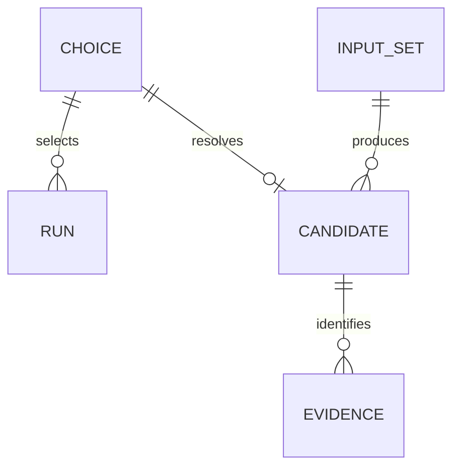

# formicarium 統合の機能設計

## 目的と境界

承認済み FR1–FR8 / NFR1–NFR5 を既存責務内で満たす。既存接続の動作を保持し、追加の設計は配置途中の失敗の保全と証跡の再結合を中心とする。新しい runtime 採用や公開は含めない。省略された Unit / domain 文書は作らず、現在 CodeKB の構造を使う。

データの正本は entities.md、判断規則の正本は rules.md。本書は処理順と状態遷移の正本。既存候補を直接作業用に使わず、新しい候補を別の場所に生成して検証する。過去証跡に結び付いた候補は上書き対象から除外し、新しい出力先を使う。

## 接続・実行フロー

1. 選択した tool/ref/source_commit を取得する。guest 宣言の有無で public 接続または既存 legacy 接続へ分岐する（BR1.1）。
2. public 接続は resolver の identity を照合し、独立した guest bytes と fixture を取得する。fixture を初期化し、選択された cwd と environment を接続する。
3. 実行要求を直列に処理し、args/env/timeout/取消情報を渡す。stdout/stderr は独立して decode し順序付き callback だけを表示する。返却された raw output を重ねて表示しない（BR1.2）。
4. 終了結果を既存イベントへ戻す。例外は通知して queue を回復させ、後続要求を処理可能にする。
5. 切替・disconnect は旧世代を無効にし、その世代の遅延起動・出力・終了を現在の端末へ反映しない。旧接続を破棄する。
6. iframe は送信元と origin の両方が一致する親の既存メッセージだけを要素へ渡す（BR1.3）。新しい UI や公開 API は追加しない。

## 候補組立と失敗時の保全

保全対象は候補ディレクトリ全体の相対パス・bytes・ファイル種類・リンク先文字列。inventory は entities.md の正本に従い、通常ファイルの size/digest、ディレクトリの存在、リンクの種類とリンク先文字列を区別する。リンク先を追跡して同じ内容の通常ファイルと同一視しない。既存候補の検証証跡は別記録として保全する。作業開始前の全件 inventory を基準とし、失敗後に同じ要素集合・種類・各種類の保存内容であることを確認する。別処理による同時更新を許可せず、出力先を専有できない場合は確定前に失敗する。

1. 出力先の境界を確認する。ソースルート、履歴候補、別処理が使用中の出力先を拒否する。入力検証前に旧候補を削除しない。前回の正常な履歴と復旧対象の区別を下記の完了条件で確認する。
2. 固定入力、package asset、resolver、advertised guest / fixture / provenance を全件検証する。失敗は非成功で終了し、旧候補に変更を加えない（BR2.1）。
3. 新しい attempt_id で対象出力先、入力、旧候補 inventory、保持場所、専用作業領域を別記録に結び付け、completion を incomplete として保存する。記録できなければ旧候補を動かさず失敗する。出力先と同じファイルシステムの専用作業領域で候補全体を組み立てる。無関係な tool metadata を保持し、すべての追加物・bundle・stamp・receipt を完成させる。単一 asset の置換を確定とはしない。
4. 作業候補の inventory と参照整合性を確認する。失敗は作業領域を清掃して非成功で終了する。候補なしの場合、対象出力先は存在しないか、有効候補として選択されない。
5. 全工程が成功した候補だけを確定する。旧候補がある場合は復旧可能な別名に保持してから新候補を切り替え、切替が失敗したら旧候補を復旧する。切替中はブラウザ検証・候補選択を開始しない。常時読取り可能な公開環境への無停止切替保証は今回含めない。
6. 確定後の旧候補保持物は履歴として残す。今回の不要な一時配置物だけを清掃し、新候補と保持物の inventory を確認してから completion を completed_ready として確定する。通常失敗後に旧候補保全・復旧と清掃が完了した場合は completed_failed とする。清掃・復旧または完了記録の確定が失敗した場合は成功とせず、保存可能なら recovery_required を記録し、完全な新候補の有無、旧候補保持場所、残存物、復旧手順を報告する（BR2.2）。記録の保存にも失敗した場合は診断出力で示し、未完了記録を正常完了とは扱わない。
7. 次回、完了記録と保持物が一致する正常履歴は保持したまま新しい試行を開始できる。未完了・復旧必要・記録欠落・不整合な作業領域や保持物だけは自動上書きせず、候補の識別と復旧手順を示して停止する。強制終了や電源断に自動復旧・無中断を保証しない。未検証の候補を ready として扱わない。

### 完了記録と残存物の判定

正常履歴の条件は、試行記録の completion が completed_ready または completed_failed であり、記載された保持場所の旧候補 inventory が一致し、当該試行の作業領域に未清掃物がないこと。completed_ready の場合は、その試行で確定した新候補 inventory の記録も必須とする。現在の対象出力先の内容は最新の正常試行と照合し、より古い正常試行の新候補と一致することは要求しない。古い保持物は自身の旧候補 inventory で照合する。

完了状態だけが一致しても、保持物の種類・内容・リンク先の変化、宣言されない残存物、記録の欠落・破損があれば停止する。incomplete / recovery_required は保持物の有無にかかわらず復旧対象とする。正常履歴の保持と、新しい試行の作業領域の清掃は別の操作であり、清掃で履歴を削除しない。

### 終了状態と負例

| 条件 | 旧候補あり | 旧候補なし | 検証期待値 |
| --- | --- | --- | --- |
| 入力不一致 | 旧候補保持 | 有効候補なし | 非成功、旧 inventory 一致、不一致箇所を報告 |
| 作業配置・bundle・stamp・receipt の途中失敗 | 旧候補保持 | 有効候補なし | 非成功、一時配置物清掃、旧 inventory 一致 |
| 確定切替の失敗、復旧成功 | 旧候補復旧 | 有効候補なし | 非成功、旧 inventory 一致、部分新候補を選択しない |
| 復旧失敗 | 保持物を残す | 有効候補なし | recovery_required、保持場所と復旧手順を報告、再組立を自動継続しない |
| 清掃失敗 | 旧候補または完全な新候補と保持物を識別 | 完全な新候補の有無を識別 | 非成功、残存物を列挙し ready な今回結果にしない |
| 強制終了後の再実行 | 残存物を保全して停止 | 残存物を保全して停止 | 未検証扱い、復旧案内、勝手な削除なし |
| 正常完了後の再実行 | 正常履歴を保持して開始 | 正常完了記録を保持して開始 | 新 attempt_id、正常保持物の存在だけで停止しない |
| 完了記録欠落・不整合 | 保持物を保全して停止 | 残存物を保全して停止 | 復旧案内、正常履歴と誤判定しない |
| 保全内容の種類変更・リンク先変更 | 変更を検出して停止 | 該当保全対象なし | 同じ読出し bytes の通常ファイルとリンクの置換も不一致 |
| 成功 | 完全な新候補、旧候補は履歴保持 | 完全な新候補 | 成功、入力・全 candidate inventory・receipt が一致 |

正常系に加え、旧候補あり・なしの作業書込み途中失敗、切替失敗、復旧失敗、清掃失敗を再現可能な負例で試験する。少なくとも部分配置と切替の両境界で失敗を注入し、単なる不正入力テストで置き換えない。正常完了後の再実行が履歴を維持して開始できる正常例と、incomplete / recovery_required、記録欠落・不整合、完了記録確定失敗によって停止する負例を追加する。種類とリンク先の比較は、同じ bytes の通常ファイルへのリンク置換、リンク先文字列の変更、ディレクトリ欠落で不一致を検出する。具体的な障害注入方法と保存先の安全な検査は実装計画で確定する。

## 状態遷移

| 対象 | 遷移 | 条件 |
| --- | --- | --- |
| RUN | queued → running → ended | 現在世代、正常終了 |
| RUN | running → failed | 例外・取消・timeout。通知後も queue は使用可能 |
| RUN | queued / running / ended / failed → disposed | 切替・disconnect。以降の旧世代結果を抑止 |
| CANDIDATE | preparing → ready | 完全な組立・整合検証・確定・清掃が成功 |
| CANDIDATE | preparing → failed | 通常失敗、旧候補保全または復旧、一時物清掃成功 |
| CANDIDATE | preparing → recovery_required | 復旧または清掃の失敗、強制終了の残存物検出 |
| CANDIDATE | recovery_required → preparing | 人が残存物と候補を確認し安全な復旧を完了した後、新しい試行を開始 |

ready と failed はその試行の結果。変更・再試行は新しい記録として識別する。

## 派生モデル・規則一覧

以下は entities.md の関係を派生表示。Mermaid 12.1.0 の parser で生成前に検証済み（mise 管理 Bun、exit 0）。

文章代替: 選択は複数の実行を持ち、利用する候補があれば一つに解決される。一つの固定入力から複数の候補を作れ、候補には複数の証跡が結び付く。

BR1.1 は選択と互換分岐、BR1.2 は実行 lifecycle、BR1.3 は iframe 境界、BR2.1 は入力検証、BR2.2 は候補確定と復旧、BR3.1 は変更承認とレビュー、BR3.2 は現在対象の検証、BR3.3 は履歴保全と U3 返送を規定する。

## 検証と引継ぎ

1. 修正計画で現在の source inventory、影響範囲、対応規則と既存テストの不足を示し、必要な承認を得る（BR3.1）。既存契約の維持が確認できる部分は不要な書換えをしない。
2. 修正後に型検査、unit、build、適用 lint、専用と legacy の三ブラウザ検証を実行する。成功、失敗、skip と理由を分け、古い件数を現在の期待値に固定しない（BR3.2）。
3. すべてのログを source / input / candidate の identity、ツール環境、日時、command / exit / 件数と結び付ける。実行中の対象変更は記録の適用性を失わせ、変更後に必要な検証を再実行する。
4. 独立レビューの識別子と指摘の判断を記録し、未解決事項を成功に含めない。既存承認・完了 intent・検証記録は変更しない。
5. 結果と参照を formicarium intent 261006-npm-terrarium-release の U3 へ返す（BR3.3）。U3 の状態を代行変更しない。公開 RC、実 Pages / service worker、実 Safari、remote Linux CI は未検証として明記する。

## Sources

- 承認済み [requirements](../../inception/requirements-analysis/requirements.md) と本段階 [questions](functional-design-questions.md): Q1 A、Looks correct。
- 現在 CodeKB の component-inventory / architecture / code-structure。historical 節は過去の記録としてのみ扱う。
- 現行 asset staging は検証後に順次書込み、site assembly は候補を削除して組み立てる。この保全不足を上記の候補全体の処理で修正する。実装の変更はまだ行っていない。

## Assumptions & Open Questions

同時更新・常時公開読取りは対象外。通常の捕捉可能な I/O 失敗を復旧試験の対象とし、強制終了は残存検出と復旧案内まで。runtime 方針差の採用判断と AGENTS.md の正式更新制約は要件書の通り保持する。
